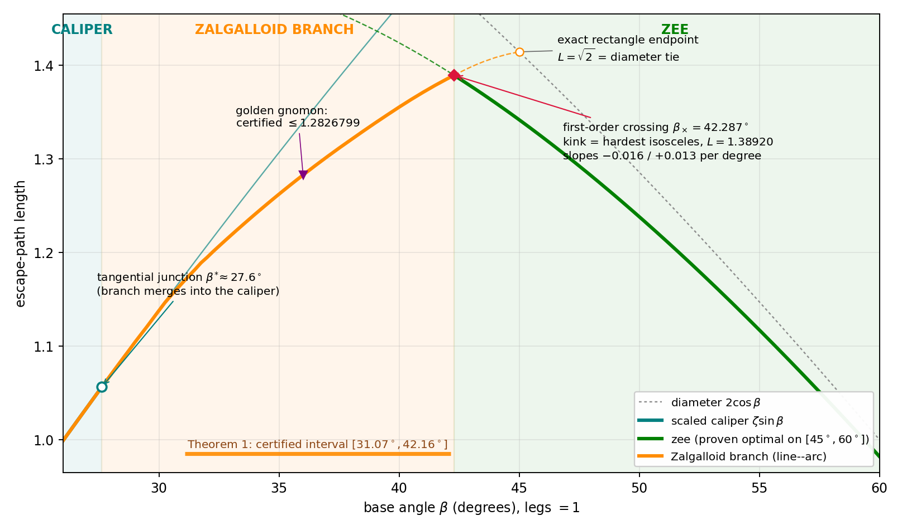

# The three regimes of escape paths for isosceles triangles in Bellman's lost-in-a-forest problem

Paper sources, machine-checkable proofs, and discovery code for:

> A. Temerev and A. Doria, *The three regimes of escape paths for isosceles
> triangles in Bellman's lost-in-a-forest problem* (2026). Sources in
> [`paper/`](paper/).

## What this is

Bellman's lost-in-a-forest problem asks for the shortest path guaranteed to
reach the boundary of a convex region of known shape from an unknown starting
point and heading. For isosceles triangles with base angles below 45° the
problem is open; the best published candidates were compared numerically by
J. W. Ward (2008), whose "square path" led on base angles (32.36°, 41.34°).

This work proves a new upper bound on an entire interval of base angles.
An explicit piecewise-polynomial family of three-segment trapezoidal paths
("staples") **S(u)**, u = tan(β/2):

- **escapes** the triangle T(β) (unit legs, base angle β) and is **strictly
  shorter than every escaping square path** for all β ∈ [31.08°, 42.16°];
- is also strictly shorter than the diameter, the scaled Zalgaller caliper,
  and the Besicovitch–Movshovich zee for all β ∈ [31.50°, 42.16°] — a range
  that strictly contains Ward's (32.36°, 41.34°) at both ends, turning the
  trapezoidal improvement he reported (without data) into a theorem.

At the type example, the **golden gnomon** (apex 108°, base angles 36°), the
bound is

    ℓ(T) ≤ (3751558 + 2·√20693661817348) / 10⁷ = 1.2849615334…  <  1.284962

versus 1.2934740… for Ward's square path, together with the closed-form
lower bound ℓ(T) ≥ (3/10)·√(25 − 5√5) = 1.1152441….

The proofs are exact. Escape from a triangle reduces — via the planar case
of a containment theorem of Lutwak — to one polygon-contains-disk inclusion
for an explicit Minkowski sum, and every inequality becomes a
rational-polynomial sign condition on a rational interval, verified by
endpoint signs and Sturm root counts in exact integer arithmetic. No
floating point enters any accepted certificate. **Optimality is not
claimed.**

## New in v2: line-arc paths (with Alessio Doria)

- Exact line-arc certificate at the golden gnomon: **l(T) <= 1.2826799**
  (verification/arc_certificate.py; 18 direction-window checks, all exact).
- The critical line-arc path characterized exactly: curvature radius forced
  to sin(beta); tan-half-angles of degree 16 (palindromic minimal
  polynomials); arc-angle sines are roots of explicit quartics over
  Q(sqrt5); critical length 1.28267602545904805617809... (Zalgaller-form).
- The "Zalgalloid" family (numerical): the smoothed staple deforms
  continuously into the scaled Zalgaller caliper at beta* ~ 27.6 deg
  (discovery/zalgalloid_family.py, figures/fig_zalgalloid_morph.png),
  answering Ward's 2008 speculation affirmatively.

## New in v3: the three regimes (phase picture)

The paper is now organized as a classification. The best-known escape paths
for T(β) form three regimes:

- **zee** (β ≥ β× = 42.287°): proven optimal on [45°, 60°]
  (Coulton–Movshovich 2006, Movshovich 2012); best known down to β×.
- **Zalgalloid branch** (β* ≈ 27.6° ≤ β ≤ β×): one connected branch of
  line-arc paths (hull boundary minus a chord), from near-polygonal
  trapezoids at the top to Zalgaller's caliper at the bottom.
- **caliper** (β ≤ β*): the scaled Zalgaller caliper, ℓ ≤ ζ·sin β.

The two boundaries differ in kind — this is the paper's organizing
observation:

- **β× = 42.287° is first-order**: a transversal crossing (slopes −0.0163 vs
  +0.0132 per degree); both families persist as local optima past it; the
  zee refuses corner-rounding (a free rounding radius optimizes to 0 at
  every angle); and the envelope kink is its **maximum** — the hardest
  isosceles triangle sits exactly at the phase boundary (L = 1.38920).
- **β\* ≈ 27.6° is second-order**: the branch merges tangentially into the
  caliper — bar length and caliper gap vanish together, no kink.
- Bonus exact fact: the branch terminates at β = 45° in an exact rectangle
  path of length √2, tied with the diameter of the right isosceles triangle
  (ten of the twelve certificate margins vanish — a maximally degenerate
  endpoint).



New discovery code: `discovery/zigzag_branch.py` (diagonal vs boundary
branches, with cutting-plane refinement of the escape constraints),
`discovery/crossing_fine.py` (crossing localization and slopes),
`discovery/regime_diagram.py` (the figure).

## Repository layout

```
paper/          staple.tex, staple.pdf — the manuscript (amsart; builds with tectonic)
verification/   the complete machine-checkable proofs (arXiv ancillary files)
  tight_staple_proof.py         verifies the golden-gnomon theorem
  interval_construction.json    exact rational coefficients of the family S(u)
                                (printed in Appendix B of the paper)
  interval_certificate.py       verifies all 116 Sturm certificates of the
                                interval theorem
discovery/      numerical code that found the witnesses (not used in proofs)
  staple_family.py              per-angle staple optimization (escape functional)
  critical_staple.py            tangency system + KKT point at the gnomon
  staple_branch_solver.py       30-digit Newton continuation of the branch curves
  fit_and_inflate.py            polynomial fits, rationalization, inflation
  results/                      solved branch curves, crossings, reports
```

## Reproducing the proofs

Requirements: Python 3.9+, `sympy`, `numpy`, `scipy` (numpy/scipy only used
for the convex-hull cycle in the gnomon script; the accepted certificates are
symbolic).

```
cd verification
python3 tight_staple_proof.py      # ~2 min;  expected: "ALL CERTIFICATES PASS"
python3 interval_certificate.py    # ~10 min; expected: "116/116 certificates PASS"
```

`interval_certificate.py` re-derives every certificate polynomial from
`interval_construction.json` and the exact triangle geometry, then certifies
strict positivity on each rational interval by endpoint signs plus an exact
Sturm root count (`sympy.Poly.count_roots`).

## Key numbers

| quantity | value |
|---|---|
| certified interval (escape + beats every square path) | β ∈ [31.0719°, 42.1633°] |
| certified interval (beats diameter, caliper, zee, squares) | β ∈ [31.50°, 42.16°] |
| Ward's square-path range (2008) | (32.36°, 41.34°) |
| golden gnomon upper bound | 1.2849615334… |
| golden gnomon lower bound | (3/10)√(25−5√5) = 1.1152441034… |
| square-path regime switch (Ward's ≈39.1°) | β₀ = 39.1320…° |
| staple–caliper crossing, polygonal (numerical) | β ≈ 31.05° |
| branch–caliper junction with arcs, second-order (numerical) | β* ≈ 27.6° |
| zee crossing, first-order (numerical; Gibbs conjectured 42.3°) | β× = 42.287° |
| envelope maximum = hardest isosceles triangle (numerical) | L = 1.38920 at β× |
| arc turn-on inside the branch (numerical) | β ≈ 42.9° |
| branch endpoint (exact) | rectangle path, L = √2 at β = 45° |

## References

- J. W. Ward, *Exploring the Bellman forest problem*, manuscript (2008)
  ([original](http://wardsattic.com/math/BellmanForestProblem/BellmanForestProblem.pdf),
  [archived](https://web.archive.org/web/20250216114838/http://wardsattic.com/math/BellmanForestProblem/BellmanForestProblem.pdf))
- E. Lutwak, *Containment and circumscribing simplices*, Discrete Comput.
  Geom. 19 (1998), 229–235
- S. R. Finch, J. E. Wetzel, *Lost in a forest*, Amer. Math. Monthly 111
  (2004), 645–654

## Acknowledgment

The computations, the verification scripts, and the initial draft of the
manuscript were produced with the assistance of Claude (Anthropic).

## License

Code and data: MIT (see [LICENSE](LICENSE)). The manuscript in `paper/` is
© the author.
